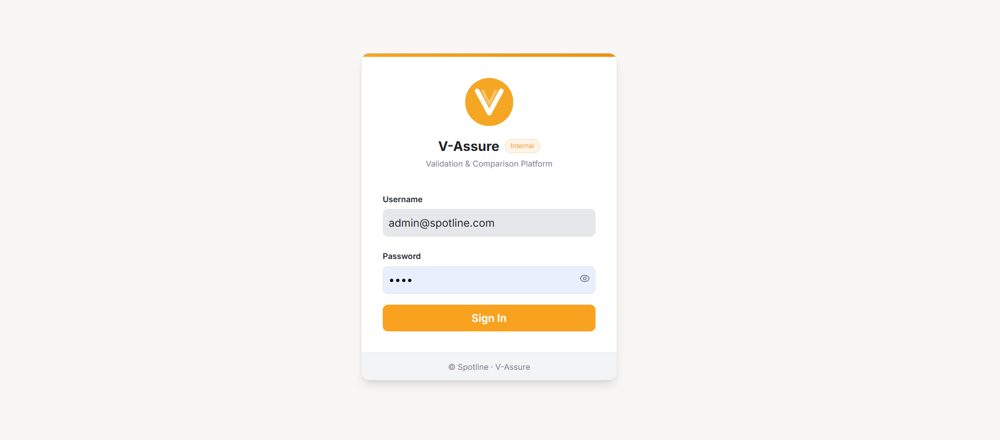
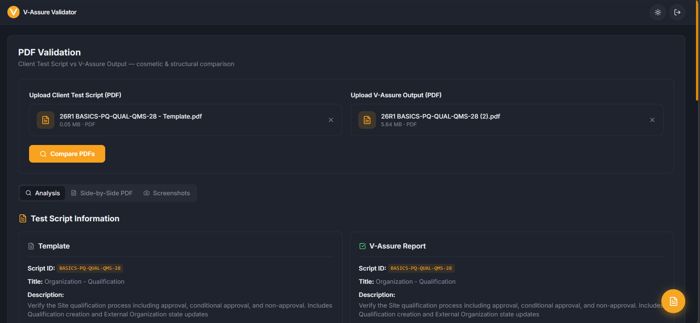
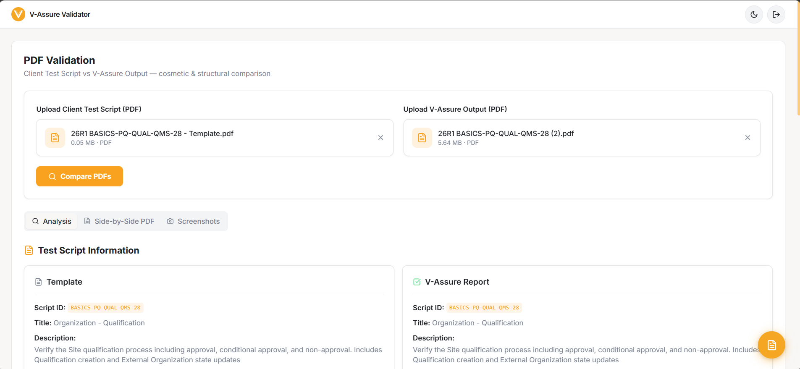

# V-Assure — Internal Validation Platform

> Automated PDF validation & comparison tool for enterprise test script verification (Spotline Inc.)

---

## 🧠 Overview

**V-Assure** is an internal validation platform designed to eliminate manual effort in comparing **Veeva Vault test scripts**.

It performs **structured, step-level comparison** between:

* Client-provided template PDFs
* V-Assure executed output PDFs

The system highlights differences, aligns execution steps, and enables reviewers to validate results **faster and with higher accuracy**.

---

## 🎯 Problem Statement

Manual validation of test scripts involves:

* Comparing large PDF documents manually
* Tracking differences across setup and execution steps
* Managing screenshots and validation notes separately

This leads to:

* ⏱️ High time consumption
* ❌ Human errors
* 🔁 Repetitive validation workflows

---

## 💡 Solution

V-Assure automates the entire validation workflow by:

* Parsing structured data from PDFs
* Running a custom **diff engine** for step-level comparison
* Rendering side-by-side visual comparison
* Mapping screenshots to execution steps
* Providing a built-in validation workspace

---

## 🖼️ Screenshots

### 🔐 Login

<p align="center">
  
</p>

---

### 📊 Dashboard (Dark Mode)

<p align="center">
  
</p>

---

### 📊 Dashboard (Light Mode)

<p align="center">
  
</p>

---

## ⚙️ System Architecture

```
          ┌──────────────────────┐
          │     React Frontend   │
          │  (PDF Viewer + UI)   │
          └─────────┬────────────┘
                    │ API Calls
                    ▼
          ┌──────────────────────┐
          │     FastAPI Backend  │
          │  (Auth + Compare API)│
          └─────────┬────────────┘
                    │
        ┌───────────┼────────────┐
        ▼           ▼            ▼
 PDF Parser   Diff Engine   Screenshot Mapper
(pdfplumber)  (Custom NLP)   (Page Extractor)
        │           │            │
        └───────────┴────────────┘
                    │
                    ▼
          ┌──────────────────────┐
          │   MongoDB Atlas DB   │
          └──────────────────────┘
```

---

## 🔄 Application Flow

1. User logs in via JWT authentication
2. Uploads:

   * Client Test Script PDF
   * Executed Output PDF
3. Backend:

   * Extracts structured steps
   * Runs comparison engine
   * Detects mismatches
4. Frontend:

   * Displays diff results
   * Renders PDFs side-by-side
   * Highlights differences
5. User:

   * Reviews mismatches
   * Adds notes via Validation Notepad
   * Exports findings

---

## 🚀 Key Features

### 🔍 Intelligent Diff Engine

* Word-level comparison (GitHub-style)
* Detects:

  * Procedure mismatches
  * Missing steps
  * Structural inconsistencies

---

### 📄 Side-by-Side PDF Viewer

* High-resolution rendering (3× scale)
* Sync scroll toggle
* Highlight overlays

---

### 🖼️ Screenshot Mapping

* Extracts screenshot pages
* Links them to:

  * Procedure steps
  * Expected results

---

### 📝 Validation Notepad

* Floating workspace
* Paste screenshots (`Ctrl + V`)
* Add notes
* Copy formatted output (FreshDesk ready)

---

### 🔐 Secure Authentication

* JWT-based authentication
* MongoDB-backed user system
* Internal-only access

---

## 🛠️ Tech Stack

### Frontend

* React
* TypeScript
* Vite
* Tailwind CSS
* shadcn/ui
* PDF.js

### Backend

* FastAPI
* Python 3.11
* pdfplumber
* pymongo
* python-jose

### Infrastructure

* Docker & Docker Compose
* AWS EC2 (t2.micro)
* Nginx
* Let's Encrypt SSL

---

## 📁 Project Structure

```
VASURE-VALIDATOR/
├── backend/
│   ├── compare/
│   │   ├── __pycache__/
│   │   ├── __init__.py
│   │   ├── comparator.py
│   │   ├── debug_comparator.py
│   │   ├── dynamic_rules.py
│   │   ├── extractor_client_basics.py
│   │   ├── extractor_executed.py
│   │   ├── metadata.py
│   │   ├── schemas.py
│   │   ├── service.py
│   │   └── text_parsers.py
│   ├── venv/
│   ├── __init__.py
│   ├── app.py
│   ├── auth.py
│   ├── Dockerfile
│   ├── requirements.txt
│   └── .dockerignore
├── frontend/
│   ├── node_modules/
│   ├── public/
│   └── src/
│       ├── components/
│       ├── hooks/
│       ├── lib/
│       ├── pages/
│       ├── test/
│       ├── types/
│       ├── App.css
│       ├── App.tsx
│       ├── index.css
│       └── main.tsx
│   ├── .dockerignore
│   ├── .gitignore
│   ├── bun.lockb
│   ├── components.json
│   ├── Dockerfile
│   ├── eslint.config.js
│   ├── index.html
│   ├── nginx.conf
│   ├── package-lock.json
│   ├── package.json
│   ├── postcss.config.js
│   ├── tailwind.config.ts
│   ├── tsconfig.app.json
│   ├── tsconfig.json
│   ├── tsconfig.node.json
│   ├── vite-env.d.ts
│   ├── vite.config.ts
│   └── vitest.config.ts
├── assets/
│   ├── login.png
│   ├── dashboard-dark.png
│   └── dashboard-light.png
├── .env
├── .gitignore
├── docker-compose.yml
├── README.md
└── requirements.txt
```

---

## 🧪 Local Setup

```bash
git clone https://github.com/yourusername/V-Validator.git
cd V-Validator
```

### Frontend

```bash
cd frontend
npm install
npm run dev
```

### Backend

```bash
cd backend
python -m venv venv
venv\Scripts\activate
pip install -r requirements.txt
uvicorn app:app --reload
```

---

## 🐳 Production Deployment

```bash
docker-compose up -d --build
```

---

## 📊 Impact

* ⚡ Reduced validation time significantly
* 🎯 Improved accuracy in script comparison
* 📉 Eliminated manual diff effort
* 🧩 Centralized validation workflow

---

## 🔮 Future Enhancements

* AI-based semantic comparison
* Auto defect classification
* Export reports (PDF/Excel)
* Role-based access control

---

## 📄 License

Internal Tool — Spotline Inc.
